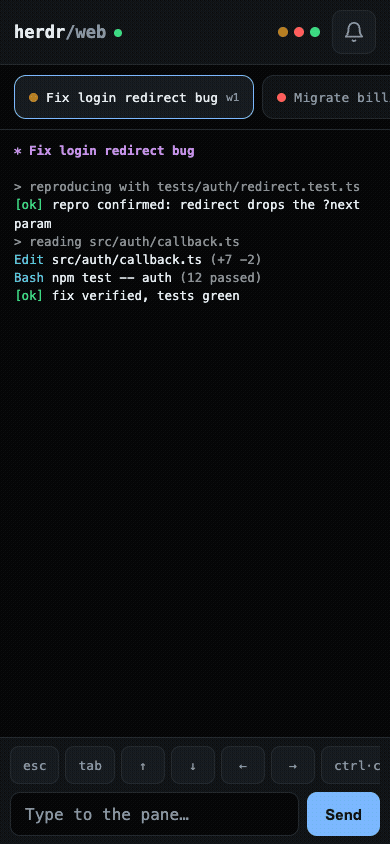
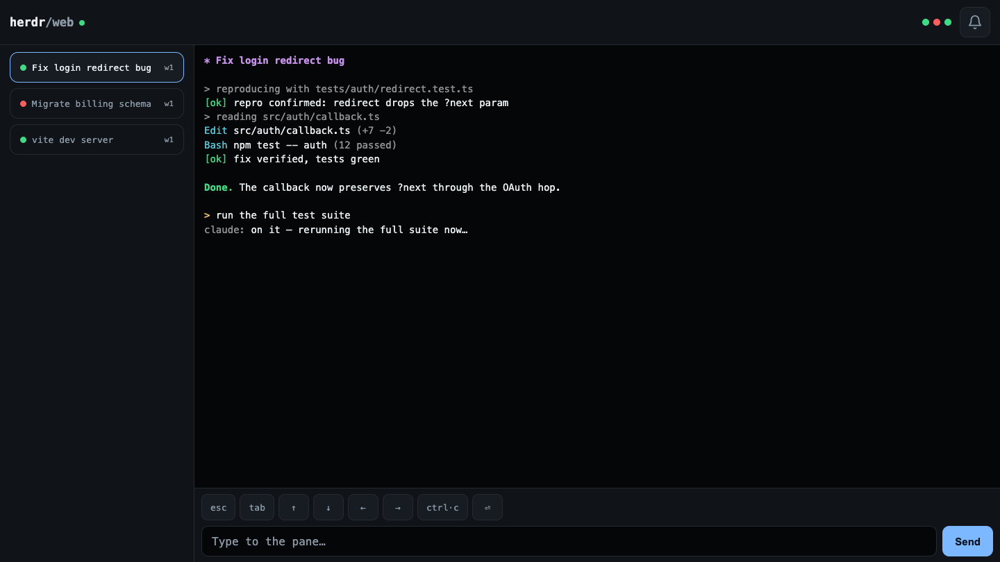

# herdr-web

Mobile-first web UI plugin for [herdr](https://herdr.dev) — view and drive your coding-agent
panes from a phone browser, with notifications when an agent finishes or gets stuck.
Fits desktops too: at wide viewports the pane list becomes a sidebar next to a full-height
terminal.

<p align="center"></p>



## Features

- **Live pane view** — rendered terminal output (ANSI colors preserved) streamed over WebSocket.
- **Agent state at a glance** — every pane is a chip with a status dot (amber = working,
  green = idle, red = blocked); the top bar shows the whole herd as a dot strip.
- **Drive panes from the phone** — send text, plus a quick-keys bar (`esc`, `tab`, arrows,
  `ctrl+c`, `enter`).
- **Notifications** — toggle the bell in the top bar; when an agent transitions out of
  `working` or into `blocked`, you get a browser/PWA notification (and an in-app toast).
- **Installable PWA** — add to home screen; app shell works offline.
- **Nerd Font icons** — ships Symbols Nerd Font Mono (MIT) as a glyph fallback, so file-manager/sidebar panes (yazi, nvim trees) render their icons on any device.

## Architecture

```
herdr CLI (HERDR_BIN_PATH)
        ▲  pane list / pane read --format ansi / pane send-*
        │  (JSON envelope parsing, polling with change detection)
   server.js  ──►  lib/ansi.js (ANSI → HTML) · lib/state-watcher.js (agent transitions)
        │  HTTP (static public/) + WebSocket (/ws)
        ▼
   React client (client/ → built into public/, committed to git)
```

The production client build is **committed to git**, so installing the plugin never needs a
frontend build — the manifest's `[[build]]` step only installs the server's single runtime
dependency (`ws`).

## Install

From GitHub:

```bash
herdr plugin install barnuri/herdr-web
```

Or from a local clone (linked in place — edits take effect without reinstalling):

```bash
git clone https://github.com/barnuri/herdr-web
cd herdr-web
npm install --omit=dev   # the [[build]] step herdr runs on a GitHub install
herdr plugin link .
```

The startup hook launches the server when herdr starts. Open it with the
`Open Herdr Web in browser` action, or visit `http://127.0.0.1:7936`.

## Configuration

`config.json` in the plugin config dir (`herdr plugin config-dir barnuri.herdr-web`):

```json
{
    "host": "127.0.0.1",
    "port": 7936,
    "topologyPollMs": 2000,
    "panePollMs": 1000,
    "readLines": 200
}
```

`HERDR_WEB_HOST` / `HERDR_WEB_PORT` env vars override the file.

## Phone access & notifications

The server binds to `127.0.0.1` by default and has **no authentication** — do not bind it to a
public interface. WebSocket upgrades from browser pages are rejected unless the page's `Origin`
matches the request host or is listed in `allowedOrigins` in `config.json` (add your proxy's
origin, e.g. `"allowedOrigins": ["https://machine.tailnet.ts.net"]`, if the proxy forwards a
different Host). Note this is same-origin enforcement, not authentication — a DNS-rebinding
attacker who controls both headers can still pass it, so keep the bind local and the proxy
authenticated. To use it from a phone:

- **Tailscale (recommended):** `tailscale serve 7936` gives you an HTTPS URL on your tailnet.
  HTTPS (or localhost) is required for service workers, PWA install, and the Notification API
  on mobile.
- Any other authenticated HTTPS reverse proxy works the same way.

Notifications use the Notification API via the service worker while the page/PWA is open
(foreground or background). True Web Push (VAPID, works with the browser fully closed) is out
of scope for v1.

## Development

One helper script per platform, same four subcommands (`setup` · `dev` · `test` · `build`,
default `dev`; deps install automatically on first run):

macOS / Linux:

```bash
scripts/dev.sh          # server on :7936 + vite dev on :5173 (ws-proxied)
scripts/dev.sh test     # server (node --test) + client (vitest) suites
scripts/dev.sh build    # rebuild public/ from client/ (commit the result)
```

Windows (PowerShell):

```powershell
scripts/dev.ps1         # same as above
scripts/dev.ps1 test
scripts/dev.ps1 build
```

## Publishing note

The herdr marketplace indexes public GitHub repos carrying the `herdr-plugin` topic — add that
topic to the repo to make the plugin discoverable.

## License

MIT
